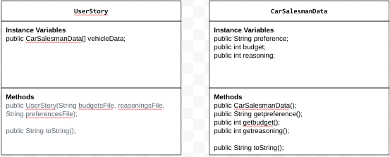

# Unit 3 - Data for Social Good Project 

## Introduction 

Software engineers develop programs to work with data and provide information to a user. Each user has different needs based on the information they are looking for from data. Your goal is to create a data analysis program for your user that stores and analyzes data to provide the information they need. 

## Requirements 

Use your knowledge of object-oriented programming, one-dimensional (1D) arrays, and algorithms to create your data analysis program: 
- **Write a class** – Write a class to represent your user or business and store and analyze their data with no-argument and parameterized constructors. 
- **Create at least two 1D arrays** – Create at least two 1D arrays to store the data that your user needs information about. 
- **Write a method** – Write a method that finds or manipulates the elements in a 1D array to provide the information your user needs. 
- **Implement a toString() method** – Write a toString() method that returns general information about the data (for example, number of values in the dataset). 
- **Document your code** – Use comments to explain the purpose of the methods and code segments and note any preconditions and postconditions. 

## User Story 

As carsalesman we want to analyze which type of vehicle is sold more (Car/Truck), so that we can create more deals and advertisements to increase car sales.

## Dataset 

Dataset: https://docs.google.com/spreadsheets/d/1UQVJm0VYuLPuKb8hpVOSYUwZJMPJ6lGHXbaL-xciGvI/edit?usp=sharing 

- VehicleType (String) - Represents the type of vehicle (Car or Truck).

## UML Diagram 

## Description 

This project analyzes data to meet the goals in the User Story, represented by the UserStory class. The program uses object-oriented programming (OOP) principles, such as encapsulation, to store details about the user's role, objective, and outcome.

The dataset from Preferences.txt contains vehicle types (Cars and Trucks). This data is stored in two one-dimensional (1D) arrays: one for the vehicle data and one for analysis results. Using methods like countVehicles, the program processes this data to find the total number of Cars and Trucks.

The toString method in the VehicleData class summarizes the dataset and analysis. The program outputs the User Story, vehicle counts, and a conclusion that explains how the results can help the salesperson improve car sales. The project uses constructors, arrays, and methods to meet the user's needs effectively.